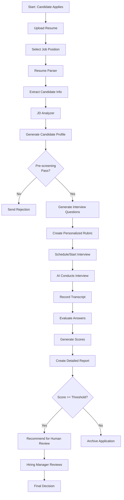
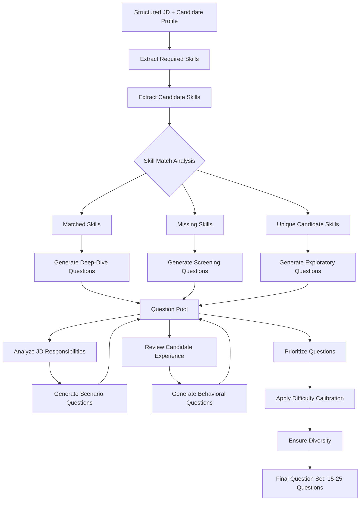
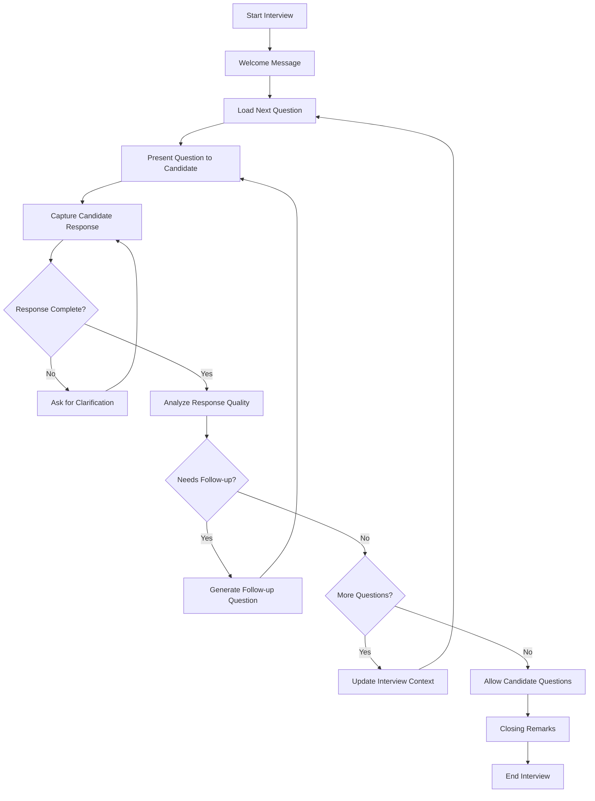
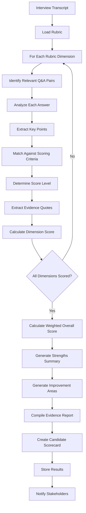

# ATS System with AI Interviewer - Design Document

## 1. Executive Summary

This document outlines the design of an intelligent Applicant Tracking System (ATS) that leverages AI to conduct automated interviews, generate relevant questions from job descriptions, analyze resumes, and create detailed scoring rubrics for candidate evaluation.

## 2. System Overview

The ATS AI Interviewer system automatically:
- Parses job descriptions to extract key requirements
- Analyzes candidate resumes to identify relevant experience
- Generates personalized interview questions based on JD and resume
- Conducts interactive AI-driven interviews
- Creates detailed evaluation rubrics
- Scores candidates quantitatively with detailed justifications

## 3. Core Components

### 3.1 Job Description Analyzer
**Purpose**: Extract structured information from job descriptions

**Logic**:
1. Parse raw job description text
2. Extract key elements:
   - Required skills (technical & soft skills)
   - Years of experience required
   - Educational qualifications
   - Responsibilities and duties
   - Nice-to-have skills
   - Company culture indicators
3. Categorize requirements by priority (must-have vs nice-to-have)
4. Generate competency framework
5. Store structured JD in database

**Output**: Structured JD object with weighted competencies

### 3.2 Resume Parser & Analyzer
**Purpose**: Extract and structure candidate information from resumes

**Logic**:
1. Accept resume in multiple formats (PDF, DOCX, TXT)
2. Use OCR and NLP to extract:
   - Personal information
   - Work experience (companies, roles, duration, responsibilities)
   - Educational background
   - Skills and certifications
   - Projects and achievements
3. Calculate experience metrics:
   - Total years of experience
   - Years in relevant roles
   - Skill proficiency indicators (frequency of mention, context)
4. Match resume against JD requirements:
   - Calculate skill overlap percentage
   - Identify gaps
   - Find unique strengths
5. Generate candidate profile summary

**Output**: Structured candidate profile with JD-match score

### 3.3 Question Generation Engine
**Purpose**: Generate relevant, contextual interview questions

**Logic**:
1. Input: Structured JD + Candidate Profile
2. Question Generation Strategy:
   
   **A. Coverage-based Questions** (60% of questions)
   - For each required skill in JD:
     - If present in resume: Generate deep-dive/validation questions
     - If absent in resume: Generate screening questions
   - Example: JD requires "Python", resume mentions "Python Django"
     → Generate: "Describe your experience with Python's async/await patterns in Django"
   
   **B. Experience-based Questions** (25% of questions)
   - Analyze candidate's work history
   - Generate behavioral questions based on their specific projects
   - Example: Resume mentions "Led team of 5"
     → Generate: "Tell me about a conflict you resolved while leading your team at [Company]"
   
   **C. Scenario-based Questions** (15% of questions)
   - Create hypothetical scenarios based on JD responsibilities
   - Test problem-solving and critical thinking
   - Example: JD mentions "Scaling microservices"
     → Generate: "How would you approach migrating a monolithic application to microservices?"

3. Question Difficulty Calibration:
   - Match difficulty to experience level
   - Start with moderate difficulty
   - Adapt based on previous answers

4. Question Diversity:
   - Technical knowledge questions
   - Behavioral/STAR format questions
   - Problem-solving scenarios
   - Culture fit questions

**Output**: Prioritized list of 15-25 interview questions with expected answer patterns

### 3.4 AI Interview Conductor
**Purpose**: Conduct interactive, conversational interviews

**Logic**:
1. **Interview Flow**:
   ```
   Start → Welcome & Context Setting → Main Interview → Candidate Questions → Closing
   ```

2. **Conversation Management**:
   - Present questions one at a time
   - Use natural language understanding to:
     - Detect when candidate has finished answering
     - Identify if answer is complete or needs follow-up
     - Recognize relevant vs tangential responses
   
3. **Dynamic Follow-up Logic**:
   - If answer is incomplete → Ask clarifying questions
   - If answer is vague → Request specific examples
   - If answer reveals interesting experience → Deep dive with follow-up
   - If answer is strong → Move to next topic
   - If answer is weak → Probe understanding or move on

4. **Adaptive Interviewing**:
   - Real-time adjustment of question difficulty
   - Skip redundant questions if already answered
   - Add bonus questions for exceptional candidates
   - Allow for conversational tangents when relevant

5. **Interview Recording**:
   - Store complete transcript
   - Tag each answer with question ID
   - Record timestamps and metadata
   - Capture candidate tone/sentiment (optional)

**Output**: Complete interview transcript with structured Q&A pairs

### 3.5 Rubric Generator
**Purpose**: Create detailed, job-specific scoring rubrics

**Logic**:
1. **Rubric Structure Creation**:
   - Identify evaluation dimensions from JD:
     - Technical Skills (broken down by specific skill)
     - Experience & Background
     - Problem-solving Ability
     - Communication Skills
     - Cultural Fit
     - Leadership/Teamwork
   
2. **Dimension Weighting**:
   - Assign weights based on JD importance:
     - Senior role → Higher weight on leadership
     - Technical role → Higher weight on technical skills
     - Junior role → Higher weight on learning ability
   
3. **Scoring Criteria Definition**:
   For each dimension, define 5-level scale:
   - **Level 1 (0-20%)**: Below expectations
     - Specific indicators of poor performance
   - **Level 2 (21-40%)**: Needs improvement
     - Indicators of basic but insufficient knowledge
   - **Level 3 (41-60%)**: Meets expectations
     - Indicators of satisfactory performance
   - **Level 4 (61-80%)**: Exceeds expectations
     - Indicators of strong performance
   - **Level 5 (81-100%)**: Exceptional
     - Indicators of outstanding performance

4. **Evidence Requirements**:
   - Define what constitutes evidence for each level
   - Link questions to rubric dimensions
   - Specify answer patterns for each score level

**Example Rubric Entry**:
```
Dimension: Python Programming (Weight: 20%)
Questions: Q3, Q7, Q12

Level 5 (81-100%): 
- Demonstrates deep understanding of advanced concepts (decorators, metaclasses, async)
- Provides specific examples of complex implementations
- Discusses trade-offs and best practices
- Shows awareness of Python internals

Level 4 (61-80%):
- Solid understanding of core concepts (OOP, data structures)
- Can explain practical applications
- Mentions some best practices
- Shows good problem-solving with Python

[... continued for each level]
```

**Output**: Comprehensive, weighted rubric with detailed scoring criteria

### 3.6 Answer Evaluator & Scorer
**Purpose**: Score candidate responses against rubric

**Logic**:
1. **Answer Analysis**:
   For each answer:
   - Extract key points and claims
   - Identify technical terms and concepts mentioned
   - Analyze structure (STAR format for behavioral questions)
   - Assess completeness and relevance
   - Check for specificity vs vagueness

2. **Rubric Mapping**:
   - Match each answer to relevant rubric dimensions
   - Some answers may contribute to multiple dimensions
   - Weight contribution based on question importance

3. **Scoring Algorithm**:
   For each rubric dimension:
   ```
   a. Collect all answers relevant to this dimension
   b. For each answer, determine which level it satisfies
   c. Generate evidence list (quotes from answers)
   d. Calculate dimension score:
      - Primary method: Highest level consistently demonstrated
      - Consider consistency across multiple questions
      - Penalize contradictions or inconsistencies
   e. Apply confidence factor (more questions = higher confidence)
   ```

4. **Evidence Generation**:
   - Extract specific quotes supporting each score
   - Link back to original questions and answers
   - Provide reasoning for score assignment

5. **Overall Score Calculation**:
   ```
   Overall Score = Σ (Dimension_Score × Dimension_Weight)
   ```

6. **Detailed Feedback Generation**:
   - Strengths: Top-performing dimensions with evidence
   - Areas for improvement: Low-scoring dimensions with specific gaps
   - Notable highlights: Exceptional answers or unique qualifications
   - Red flags: Concerning responses or major skill gaps

**Output**: 
- Numerical score (0-100) for each dimension
- Overall weighted score
- Detailed evidence-based justification
- Structured feedback report

## 4. System Workflows

### 4.1 Main Interview Workflow



### 4.2 Question Generation Logic Flow



### 4.3 Dynamic Interview Conduct Flow



### 4.4 Scoring & Evaluation Flow



## 5. Data Models

### 5.1 Job Description Model
```json
{
  "jd_id": "uuid",
  "title": "Senior Software Engineer",
  "company_id": "uuid",
  "raw_description": "text",
  "structured_data": {
    "required_skills": [
      {
        "skill_name": "Python",
        "importance": "must-have",
        "weight": 0.2,
        "proficiency_level": "expert"
      }
    ],
    "experience_requirements": {
      "min_years": 5,
      "preferred_years": 7,
      "relevant_domains": ["backend", "cloud"]
    },
    "education": {
      "required": "Bachelor's in CS or related",
      "preferred": "Master's"
    },
    "responsibilities": ["text array"],
    "competency_framework": {
      "technical": 0.6,
      "leadership": 0.2,
      "communication": 0.2
    }
  },
  "created_at": "timestamp"
}
```

### 5.2 Candidate Profile Model
```json
{
  "candidate_id": "uuid",
  "personal_info": {
    "name": "string",
    "email": "string",
    "phone": "string"
  },
  "resume_data": {
    "work_experience": [
      {
        "company": "string",
        "title": "string",
        "duration": "string",
        "responsibilities": ["array"],
        "technologies": ["array"]
      }
    ],
    "education": [],
    "skills": [],
    "certifications": [],
    "projects": []
  },
  "jd_match": {
    "jd_id": "uuid",
    "overall_match_score": 0.75,
    "skill_overlap": {
      "matched": ["Python", "AWS"],
      "missing": ["Kubernetes"],
      "additional": ["Go"]
    },
    "experience_fit": "strong",
    "education_fit": "meets"
  }
}
```

### 5.3 Interview Model
```json
{
  "interview_id": "uuid",
  "candidate_id": "uuid",
  "jd_id": "uuid",
  "scheduled_at": "timestamp",
  "status": "completed",
  "questions": [
    {
      "question_id": "uuid",
      "question_text": "string",
      "question_type": "technical|behavioral|scenario",
      "related_skills": ["Python"],
      "difficulty": "medium",
      "expected_answer_pattern": "text"
    }
  ],
  "transcript": [
    {
      "timestamp": "ISO8601",
      "speaker": "ai|candidate",
      "message": "text",
      "question_id": "uuid (if applicable)"
    }
  ],
  "duration_minutes": 45
}
```

### 5.4 Rubric Model
```json
{
  "rubric_id": "uuid",
  "jd_id": "uuid",
  "dimensions": [
    {
      "dimension_id": "uuid",
      "name": "Python Programming",
      "weight": 0.2,
      "related_questions": ["q1", "q5"],
      "scoring_criteria": {
        "level_5": {
          "range": [81, 100],
          "description": "Exceptional",
          "indicators": ["text array"]
        },
        "level_4": {
          "range": [61, 80],
          "description": "Exceeds expectations",
          "indicators": ["text array"]
        }
        // ... levels 3, 2, 1
      }
    }
  ]
}
```

### 5.5 Candidate Scorecard Model
```json
{
  "scorecard_id": "uuid",
  "interview_id": "uuid",
  "candidate_id": "uuid",
  "jd_id": "uuid",
  "scores": [
    {
      "dimension_id": "uuid",
      "dimension_name": "Python Programming",
      "score": 75,
      "level": 4,
      "confidence": 0.9,
      "evidence": [
        {
          "quote": "text from answer",
          "question_id": "uuid",
          "supporting_score": 80
        }
      ]
    }
  ],
  "overall_score": 78.5,
  "summary": {
    "strengths": ["text array"],
    "improvements": ["text array"],
    "highlights": ["text array"],
    "red_flags": ["text array"]
  },
  "recommendation": "strong_yes|yes|maybe|no|strong_no",
  "generated_at": "timestamp"
}
```

## 6. AI/ML Components

### 6.1 Language Models Used

**Primary LLM**: GPT-4 / Claude 3.5 Sonnet or similar
- Question generation
- Interview conversation
- Answer evaluation
- Feedback generation

**Supporting Models**:
- Resume parsing: Custom NER model or Document AI
- Skill extraction: Fine-tuned BERT for technical skills
- Sentiment analysis: For detecting candidate confidence/uncertainty

### 6.2 Prompt Engineering Strategy

**Question Generation Prompt Template**:
```
You are an expert technical interviewer. Generate interview questions based on:

Job Description:
{structured_jd}

Candidate Resume:
{candidate_profile}

Requirements:
1. Generate {n} questions covering: {required_skills}
2. Ensure questions are:
   - Specific to candidate's experience
   - Aligned with job requirements
   - Diverse in question types
   - Appropriate for {experience_level}
3. For each question, provide:
   - Question text
   - Expected answer pattern
   - Difficulty level
   - Related competencies

Output format: JSON
```

**Interview Conversation Prompt**:
```
You are conducting a professional job interview. You are knowledgeable, friendly, and thorough.

Context:
- Candidate: {candidate_name}
- Position: {job_title}
- Current question: {current_question}
- Interview history: {previous_qa_pairs}

Guidelines:
1. Present questions naturally and conversationally
2. Listen actively to responses
3. Ask follow-up questions when needed
4. Be encouraging but professional
5. Detect when to move forward or probe deeper

Candidate's last response: {candidate_response}

Your next message:
```

**Answer Evaluation Prompt**:
```
Evaluate the following interview answer against the rubric:

Question: {question_text}
Answer: {candidate_answer}

Rubric Dimension: {dimension_name}
Scoring Criteria:
{level_descriptions}

Tasks:
1. Analyze the answer for key points
2. Determine which level (1-5) the answer satisfies
3. Extract specific evidence (quotes) supporting your assessment
4. Provide reasoning for the score
5. Note any red flags or exceptional insights

Output format: JSON
```

## 7. Scoring Algorithm Details

### 7.1 Dimension Score Calculation

```python
def calculate_dimension_score(dimension, relevant_answers, rubric_criteria):
    """
    Calculate score for a single rubric dimension
    """
    scores = []
    evidence = []
    
    for answer in relevant_answers:
        # Use LLM to evaluate answer against criteria
        evaluation = llm_evaluate(
            question=answer.question,
            response=answer.text,
            criteria=rubric_criteria
        )
        
        scores.append(evaluation.score)
        evidence.extend(evaluation.evidence)
    
    # Calculate final dimension score
    if len(scores) == 1:
        final_score = scores[0]
        confidence = 0.7  # Lower confidence with single data point
    else:
        # Use weighted average, giving more weight to consistent performance
        final_score = calculate_weighted_average(scores)
        confidence = calculate_consistency_confidence(scores)
    
    return {
        'score': final_score,
        'confidence': confidence,
        'evidence': evidence,
        'individual_scores': scores
    }
```

### 7.2 Overall Score Calculation

```python
def calculate_overall_score(dimension_scores, rubric):
    """
    Calculate weighted overall score
    """
    total_score = 0
    total_weight = 0
    
    for dimension in rubric.dimensions:
        dim_result = dimension_scores[dimension.id]
        weighted_score = dim_result.score * dimension.weight * dim_result.confidence
        total_score += weighted_score
        total_weight += dimension.weight * dim_result.confidence
    
    # Normalize by total weight
    overall_score = (total_score / total_weight) if total_weight > 0 else 0
    
    return round(overall_score, 2)
```

## 8. Advanced Features

### 8.1 Adaptive Difficulty Adjustment
- Track answer quality in real-time
- If candidate excels: Increase question difficulty
- If candidate struggles: Provide easier questions or hints
- Ensures accurate assessment across all skill levels

### 8.2 Anti-Cheating Measures
- Random question ordering
- Time-limited responses for technical questions
- Behavioral analysis (copy-paste detection)
- Follow-up questions that require understanding, not memorization

### 8.3 Bias Mitigation
- Remove identifying information during evaluation
- Use consistent rubric for all candidates
- Audit AI decisions for fairness
- Provide explainable scoring with evidence

### 8.4 Candidate Experience
- Clear communication of interview format
- Ability to pause/resume interviews
- Practice questions before formal interview
- Immediate feedback on performance (optional)
- Transparent scoring explanation

## 9. Success Metrics

### 9.1 System Performance Metrics
- Time to complete interview: Target 30-45 minutes
- Question relevance score: Measured by hiring manager feedback
- Scoring accuracy: Correlation with human interviewer scores
- False positive rate: Candidates advanced but rejected by human
- False negative rate: Strong candidates rejected by AI

### 9.2 Business Metrics
- Time saved per hire
- Increase in candidate throughput
- Hiring manager satisfaction score
- Candidate satisfaction score
- Quality of hire (performance after 6 months)

## 10. Edge Cases & Handling

### 10.1 Incomplete Answers
- Give candidate opportunity to elaborate
- Score based on what was provided
- Note in evaluation report
- Potentially flag for human review

### 10.2 Off-Topic Responses
- Gently redirect to question
- If persistent, note communication concerns
- May indicate misunderstanding or poor fit

### 10.3 Technical Issues
- Auto-save interview progress
- Resume from last checkpoint
- Allow rescheduling without penalty

### 10.4 Ambiguous Job Descriptions
- Request clarification from hiring manager
- Generate questions based on similar roles
- Flag uncertainties in rubric generation

## 11. Future Enhancements

1. **Video Interview Support**: Analyze facial expressions and tone
2. **Coding Challenges**: Integrate live coding assessments
3. **Multi-Language Support**: Conduct interviews in candidate's language
4. **Skill Gap Training**: Recommend courses for rejected candidates
5. **Hiring Trend Analysis**: Identify patterns in successful hires
6. **Collaborative Rubrics**: Allow multiple stakeholders to input criteria
7. **Interview Practice Mode**: Help candidates prepare for real interviews

---

## Appendix A: Sample Question Generation

**Input JD Snippet**:
- Required: Python, Django, REST APIs, PostgreSQL, 5+ years experience

**Input Resume Snippet**:
- Senior Developer at TechCorp (3 years)
- Python, Flask, MySQL, Redis
- Built microservices architecture

**Generated Questions**:

1. **Technical - Deep Dive**: "You've worked with Flask. How would you compare Flask and Django for building REST APIs? When would you choose one over the other?"

2. **Experience Validation**: "I see you built a microservices architecture at TechCorp. Walk me through your design decisions and what challenges you faced with data consistency across services."

3. **Skill Gap**: "This role requires PostgreSQL experience, but I see MySQL in your background. What's your understanding of PostgreSQL's advanced features like JSONB and full-text search?"

4. **Scenario**: "How would you design a high-traffic REST API that needs to handle 10,000 requests per second while maintaining data consistency in PostgreSQL?"

5. **Behavioral**: "Tell me about a time when you had to optimize a slow database query. What was your approach and what was the outcome?"

---

## Appendix B: Sample Rubric Entry

**Dimension**: Backend Architecture Design (Weight: 25%)

**Level 5 (81-100%): Exceptional**
- Demonstrates mastery of architectural patterns (microservices, event-driven, etc.)
- Discusses trade-offs between different approaches with nuance
- Provides specific examples from experience with measurable outcomes
- Shows awareness of scalability, reliability, and maintainability concerns
- Mentions industry best practices and when to deviate from them

**Level 4 (61-80%): Exceeds Expectations**
- Strong understanding of common architectural patterns
- Can explain design decisions with reasonable justifications
- Provides relevant examples from experience
- Shows consideration for non-functional requirements
- Aware of common pitfalls

**Level 3 (41-60%): Meets Expectations**
- Basic understanding of architectural concepts
- Can discuss simple design scenarios
- Some practical experience evident
- Understands importance of scalability/reliability conceptually
- May lack depth in complex scenarios

**Level 2 (21-40%): Needs Improvement**
- Limited architectural knowledge
- Struggles with design scenarios
- Minimal relevant experience
- Focuses only on functional requirements
- Misses key considerations

**Level 1 (0-20%): Below Expectations**
- No clear understanding of architecture
- Cannot articulate design approaches
- No relevant experience
- Unaware of important considerations
- Provides incorrect or confused responses

**Evidence Requirements**:
- Specific examples of systems designed/built
- Discussion of trade-offs made
- Metrics or outcomes from architectural decisions
- Recognition of complexity and edge cases

---

*End of Design Document*
