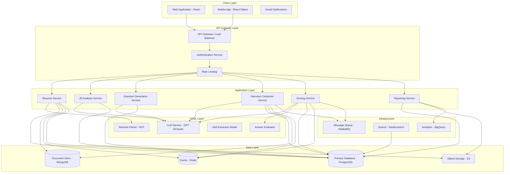
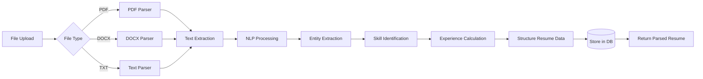
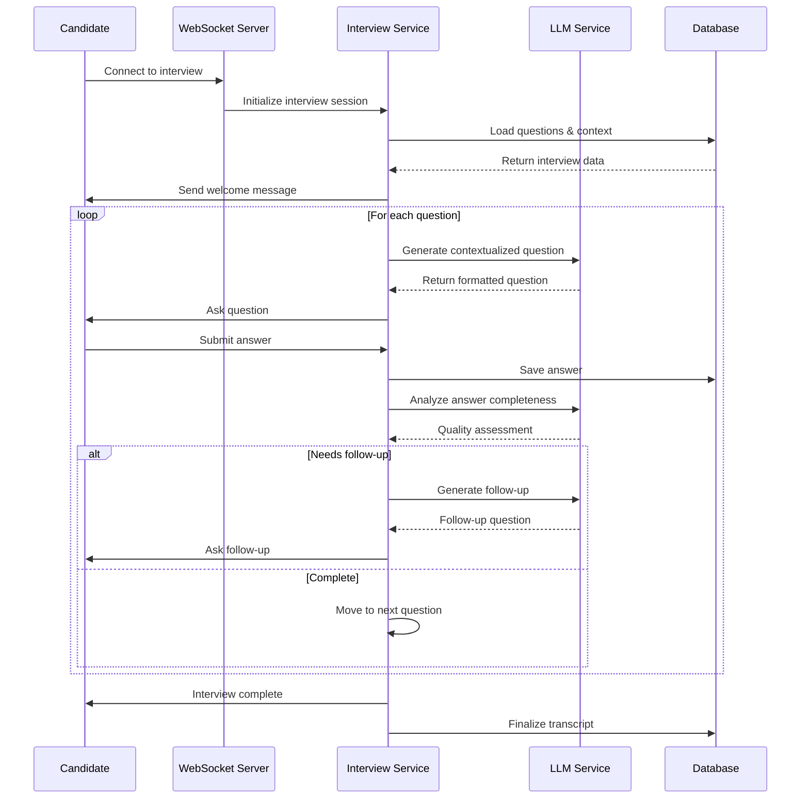
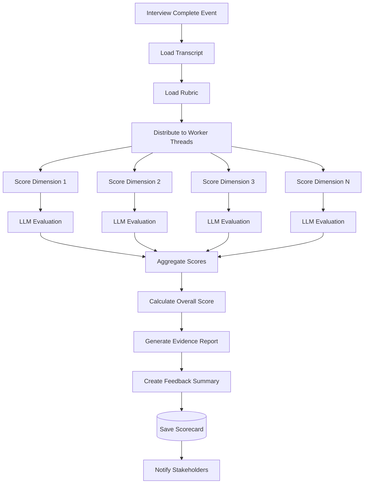
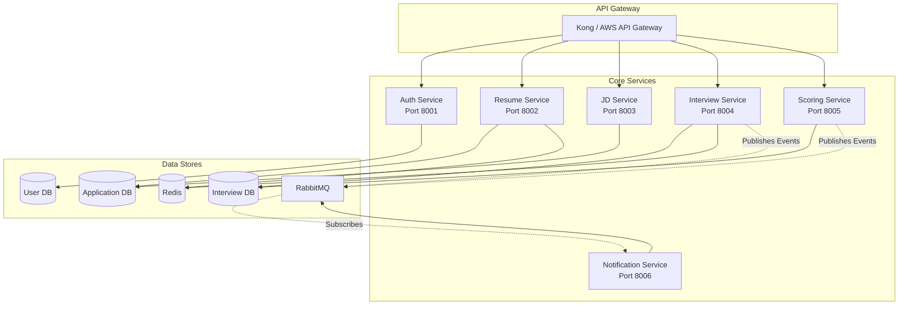
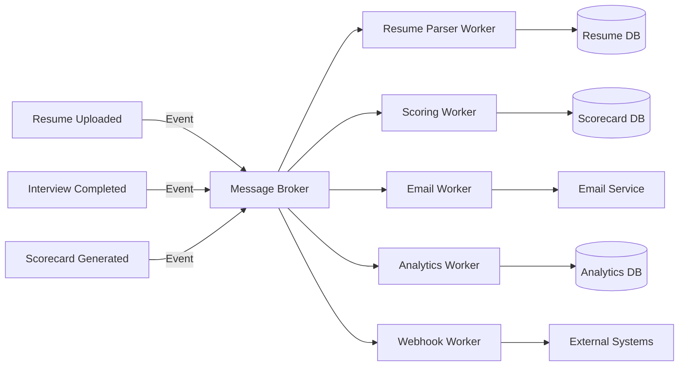
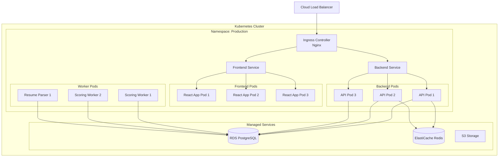
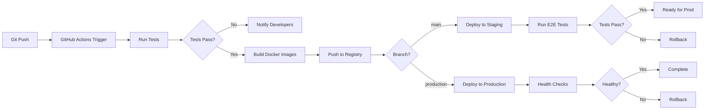

# ATS AI Interviewer - Technical Architecture & Deployment

## 1. System Architecture Overview



## 2. Technology Stack

### 2.1 Frontend

**Web Application**
- **Framework**: React 18+ with TypeScript
- **State Management**: Redux Toolkit / Zustand
- **UI Library**: Material-UI (MUI) or Tailwind CSS + Headless UI
- **Real-time Communication**: Socket.io Client
- **Forms**: React Hook Form + Zod validation
- **API Client**: Axios with React Query
- **Routing**: React Router v6

**Mobile Application**
- **Framework**: React Native with TypeScript
- **Navigation**: React Navigation
- **State Management**: Redux Toolkit
- **UI Components**: React Native Paper or NativeBase

**Key Features**:
- Responsive design for all devices
- Real-time interview interface
- File upload with drag-and-drop
- Rich text editor for job descriptions
- Interactive dashboards for recruiters
- Accessibility compliance (WCAG 2.1)

### 2.2 Backend

**Primary Backend**
- **Language**: Python 3.11+
- **Framework**: FastAPI
- **API Style**: RESTful + WebSocket for real-time
- **Async Runtime**: asyncio with uvicorn
- **Validation**: Pydantic v2

**Alternative Stack Option**
- **Language**: Node.js 20+ with TypeScript
- **Framework**: NestJS
- **Runtime**: Node.js with Express

**Why FastAPI?**
- Excellent async support for AI/LLM calls
- Native Pydantic integration for data validation
- Automatic OpenAPI documentation
- High performance for I/O-bound operations
- Strong typing with Python type hints
- Large ML/AI ecosystem

### 2.3 AI/ML Stack

**Large Language Models**
- **Primary**: OpenAI GPT-4o or Anthropic Claude 3.5 Sonnet
- **Alternative**: Open-source models (Llama 3, Mixtral) via Together AI / Replicate
- **Self-hosted Option**: vLLM or Ollama for local deployment

**ML Libraries**
- **NLP**: spaCy, Hugging Face Transformers
- **Resume Parsing**: Custom model or AWS Textract / Google Document AI
- **Vector Embeddings**: OpenAI embeddings or sentence-transformers
- **ML Ops**: MLflow for model tracking

**LLM Integration**
- **Framework**: LangChain or LlamaIndex
- **Prompt Management**: LangSmith or custom prompt registry
- **Token Management**: tiktoken for counting
- **Caching**: Semantic caching for similar queries

### 2.4 Databases & Storage

**Primary Database: PostgreSQL 15+**
- User accounts and authentication
- Job descriptions (structured data)
- Candidate profiles
- Interview metadata
- Rubrics and scoring criteria
- Application state

**Schema Design**:
```sql
-- Key tables
users (id, email, role, company_id, created_at)
companies (id, name, settings, subscription_tier)
job_descriptions (id, company_id, title, structured_data, created_at)
candidates (id, name, email, resume_path, parsed_data, created_at)
applications (id, candidate_id, jd_id, status, created_at)
interviews (id, application_id, scheduled_at, status, duration)
questions (id, interview_id, question_text, question_type, difficulty)
rubrics (id, jd_id, dimensions, created_at)
scorecards (id, interview_id, scores, overall_score, created_at)
```

**Document Database: MongoDB**
- Interview transcripts (conversational data)
- Unstructured resume text
- LLM prompt/response logs
- Audit logs

**Cache: Redis**
- Session storage
- Rate limiting counters
- Question generation cache
- Real-time interview state
- Job search results cache

**Object Storage: AWS S3 / MinIO**
- Resume files (PDF, DOCX)
- Generated reports (PDF)
- Interview recordings (optional audio)
- Company logos and assets

**Vector Database: Pinecone / Weaviate (Optional)**
- For semantic search of resumes
- Similar job description matching
- Question bank similarity search

### 2.5 Infrastructure & DevOps

**Container Orchestration**
- **Development**: Docker Compose
- **Production**: Kubernetes (EKS, GKE, or AKS)
- **Alternative**: AWS ECS / Fargate for simpler deployment

**CI/CD Pipeline**
- **Version Control**: GitHub / GitLab
- **CI/CD**: GitHub Actions / GitLab CI
- **Testing**: pytest (Python), Jest (TypeScript)
- **Code Quality**: Black, Ruff, ESLint, Prettier
- **Security Scanning**: Snyk, Trivy

**Monitoring & Observability**
- **APM**: Datadog / New Relic / Grafana + Prometheus
- **Logging**: ELK Stack (Elasticsearch, Logstash, Kibana)
- **Error Tracking**: Sentry
- **Uptime Monitoring**: Pingdom / UptimeRobot

**Message Queue**
- **Primary**: RabbitMQ or AWS SQS
- **Use Cases**:
  - Async resume processing
  - Report generation
  - Email notifications
  - Webhook deliveries

### 2.6 Security Stack

**Authentication & Authorization**
- **Auth Provider**: Auth0 / Supabase Auth / Custom JWT
- **MFA**: TOTP-based (Google Authenticator)
- **SSO**: SAML 2.0 / OAuth 2.0 for enterprise

**API Security**
- Rate limiting (Redis-based)
- API key management
- CORS configuration
- Request validation and sanitization
- SQL injection prevention (ORM usage)

**Data Security**
- Encryption at rest (database level)
- Encryption in transit (TLS 1.3)
- PII data masking
- GDPR compliance tools
- Regular security audits

**Secrets Management**
- AWS Secrets Manager / HashiCorp Vault
- Environment-specific configurations
- API key rotation

## 3. Detailed Service Architecture

### 3.1 Resume Processing Service



**Components**:
- **File Handler**: Receives and validates uploads
- **Parser Engine**: Extracts text from various formats
- **NLP Pipeline**: 
  - Named Entity Recognition (NER) for personal info
  - Custom skill extraction model
  - Date parsing for work history
  - Section classification (education, experience, skills)
- **Storage Manager**: Saves raw file to S3, metadata to PostgreSQL

**Tech Details**:
```python
# Example service structure
class ResumeProcessingService:
    def __init__(self):
        self.pdf_parser = PDFPlumber()
        self.nlp_model = spacy.load("en_resume_parser")
        self.skill_extractor = SkillExtractor()
    
    async def process_resume(self, file: UploadFile) -> ParsedResume:
        # 1. Save to S3
        s3_url = await self.save_to_storage(file)
        
        # 2. Extract text
        text = await self.extract_text(file)
        
        # 3. Parse with NLP
        entities = self.nlp_model(text)
        
        # 4. Extract structured data
        structured_data = self.extract_structured_data(entities)
        
        # 5. Save to database
        resume_id = await self.save_to_db(structured_data, s3_url)
        
        return ParsedResume(id=resume_id, data=structured_data)
```

### 3.2 Interview Conductor Service



**Key Features**:
- WebSocket-based real-time communication
- Stateful conversation management
- Dynamic question adaptation
- Timeout handling for each question
- Auto-save functionality
- Graceful error recovery

**Tech Implementation**:
```python
class InterviewConductor:
    async def conduct_interview(self, interview_id: str, websocket: WebSocket):
        # Load interview context
        interview = await self.get_interview(interview_id)
        questions = interview.questions
        context = []
        
        await websocket.send_json({
            "type": "welcome",
            "message": f"Welcome {interview.candidate_name}..."
        })
        
        for question in questions:
            # Present question
            await self.ask_question(websocket, question, context)
            
            # Wait for answer
            answer = await self.receive_answer(websocket, timeout=300)
            
            # Save answer
            await self.save_answer(interview_id, question.id, answer)
            
            # Analyze and potentially follow up
            analysis = await self.llm.analyze_answer(question, answer)
            
            if analysis.needs_followup:
                followup = await self.llm.generate_followup(
                    question, answer, context
                )
                await self.ask_question(websocket, followup, context)
                followup_answer = await self.receive_answer(websocket)
                await self.save_answer(interview_id, followup.id, followup_answer)
            
            # Update context for next question
            context.append({"question": question, "answer": answer})
        
        await websocket.send_json({"type": "complete"})
```

### 3.3 Scoring Service



**Parallel Processing**:
- Each rubric dimension scored independently
- Use async/await or thread pool for concurrency
- Batch LLM calls when possible
- Cache similar evaluations

**Tech Implementation**:
```python
class ScoringService:
    async def score_interview(self, interview_id: str) -> Scorecard:
        # Load data
        transcript = await self.get_transcript(interview_id)
        rubric = await self.get_rubric(interview_id)
        
        # Score each dimension in parallel
        tasks = [
            self.score_dimension(dimension, transcript)
            for dimension in rubric.dimensions
        ]
        dimension_scores = await asyncio.gather(*tasks)
        
        # Calculate overall score
        overall = self.calculate_overall_score(
            dimension_scores, rubric.weights
        )
        
        # Generate summary
        summary = await self.generate_summary(dimension_scores, transcript)
        
        # Create and save scorecard
        scorecard = Scorecard(
            interview_id=interview_id,
            scores=dimension_scores,
            overall_score=overall,
            summary=summary
        )
        
        await self.save_scorecard(scorecard)
        return scorecard
```

## 4. Systems Design Patterns

### 4.1 Microservices Architecture



**Service Communication**:
- **Synchronous**: REST APIs for request-response
- **Asynchronous**: Message queue for events
- **Service Discovery**: Kubernetes DNS or Consul
- **Circuit Breaking**: Resilience4j / Polly

**Benefits**:
- Independent scaling of services
- Technology diversity (different languages per service)
- Fault isolation
- Easier testing and deployment

### 4.2 Event-Driven Architecture



**Key Events**:
- `resume.uploaded`
- `candidate.applied`
- `interview.scheduled`
- `interview.started`
- `interview.completed`
- `scoring.completed`
- `application.status_changed`

**Event Schema Example**:
```json
{
  "event_id": "uuid",
  "event_type": "interview.completed",
  "timestamp": "ISO8601",
  "version": "1.0",
  "data": {
    "interview_id": "uuid",
    "candidate_id": "uuid",
    "jd_id": "uuid",
    "duration_minutes": 42
  }
}
```

### 4.3 Caching Strategy

**Multi-Level Caching**:

1. **Application Level** (Redis):
   - Session data (TTL: session duration)
   - User preferences (TTL: 1 hour)
   - Active interview state (TTL: 24 hours)

2. **API Response Caching**:
   - Job listings (TTL: 5 minutes)
   - Candidate search results (TTL: 1 minute)
   - Static content (TTL: 1 day)

3. **LLM Response Caching**:
   - Similar question generations (semantic similarity)
   - Common evaluation patterns
   - Can reduce costs by 30-50%

```python
# Example caching decorator
@cache(ttl=3600, key="jd:{jd_id}:questions")
async def generate_questions(jd_id: str) -> List[Question]:
    # Expensive LLM call
    pass
```

### 4.4 Rate Limiting & Throttling

**Strategy**:
- **Per User**: 100 requests/minute
- **Per Company**: 1000 requests/minute
- **Anonymous**: 10 requests/minute
- **LLM Calls**: 50 calls/minute per service

**Implementation**: Token bucket algorithm with Redis

```python
class RateLimiter:
    async def check_rate_limit(self, user_id: str) -> bool:
        key = f"rate_limit:{user_id}"
        current = await redis.incr(key)
        
        if current == 1:
            await redis.expire(key, 60)  # 1 minute window
        
        return current <= 100  # Max 100 requests
```

## 5. Deployment Architecture

### 5.1 Cloud-Native Deployment (Kubernetes)



**Kubernetes Resources**:

```yaml
# API Deployment
apiVersion: apps/v1
kind: Deployment
metadata:
  name: ats-api
spec:
  replicas: 3
  selector:
    matchLabels:
      app: ats-api
  template:
    metadata:
      labels:
        app: ats-api
    spec:
      containers:
      - name: api
        image: ats-api:latest
        ports:
        - containerPort: 8000
        env:
        - name: DATABASE_URL
          valueFrom:
            secretKeyRef:
              name: db-secrets
              key: url
        resources:
          requests:
            memory: "512Mi"
            cpu: "500m"
          limits:
            memory: "1Gi"
            cpu: "1000m"
        livenessProbe:
          httpGet:
            path: /health
            port: 8000
          initialDelaySeconds: 30
          periodSeconds: 10
        readinessProbe:
          httpGet:
            path: /ready
            port: 8000
          initialDelaySeconds: 5
          periodSeconds: 5
```

**Auto-Scaling Configuration**:
```yaml
apiVersion: autoscaling/v2
kind: HorizontalPodAutoscaler
metadata:
  name: ats-api-hpa
spec:
  scaleTargetRef:
    apiVersion: apps/v1
    kind: Deployment
    name: ats-api
  minReplicas: 3
  maxReplicas: 10
  metrics:
  - type: Resource
    resource:
      name: cpu
      target:
        type: Utilization
        averageUtilization: 70
  - type: Resource
    resource:
      name: memory
      target:
        type: Utilization
        averageUtilization: 80
```

### 5.2 Environment Strategy

**Environments**:
1. **Development**: Local Docker Compose
2. **Staging**: Kubernetes cluster (smaller instance types)
3. **Production**: Kubernetes cluster (HA, multi-AZ)

**Configuration Management**:
```
envs/
├── development.env
├── staging.env
└── production.env
```

**Secrets Management**:
- Development: `.env` files (not committed)
- Staging/Production: AWS Secrets Manager / Vault
- Kubernetes: Sealed Secrets or External Secrets Operator

### 5.3 Database Deployment

**PostgreSQL Setup**:
- **Development**: Docker container
- **Production**: AWS RDS PostgreSQL Multi-AZ
- **Backup**: Automated daily snapshots, 30-day retention
- **Replication**: Read replicas for reporting queries

**Migration Strategy**:
- Tool: Alembic (Python) or Flyway
- Versioned migrations in git
- Automated migration on deployment
- Rollback procedures documented

```python
# Example Alembic migration
def upgrade():
    op.create_table(
        'scorecards',
        sa.Column('id', sa.UUID(), primary_key=True),
        sa.Column('interview_id', sa.UUID(), nullable=False),
        sa.Column('overall_score', sa.Float(), nullable=False),
        sa.Column('scores', sa.JSON(), nullable=False),
        sa.Column('created_at', sa.DateTime(), server_default=sa.func.now())
    )
    op.create_index('idx_scorecards_interview', 'scorecards', ['interview_id'])
```

### 5.4 CI/CD Pipeline



**Pipeline Configuration** (GitHub Actions):
```yaml
name: CI/CD Pipeline

on:
  push:
    branches: [main, production]
  pull_request:
    branches: [main]

jobs:
  test:
    runs-on: ubuntu-latest
    steps:
      - uses: actions/checkout@v3
      - name: Set up Python
        uses: actions/setup-python@v4
        with:
          python-version: '3.11'
      - name: Install dependencies
        run: pip install -r requirements.txt
      - name: Run tests
        run: pytest tests/ --cov
      - name: Run linters
        run: |
          black --check .
          ruff check .
  
  build:
    needs: test
    runs-on: ubuntu-latest
    steps:
      - uses: actions/checkout@v3
      - name: Build Docker image
        run: docker build -t ats-api:${{ github.sha }} .
      - name: Push to registry
        run: docker push ats-api:${{ github.sha }}
  
  deploy-staging:
    needs: build
    if: github.ref == 'refs/heads/main'
    runs-on: ubuntu-latest
    steps:
      - name: Deploy to staging
        run: |
          kubectl set image deployment/ats-api \
            api=ats-api:${{ github.sha }} \
            -n staging
```

## 6. Scalability Considerations

### 6.1 Horizontal Scaling

**Stateless Services**: All API services are stateless
- Store session in Redis, not in-memory
- Use load balancer for distribution
- Can scale from 3 to 100+ pods based on load

**Database Scaling**:
- Read replicas for reporting queries
- Connection pooling (PgBouncer)
- Query optimization and indexing
- Consider sharding for 1M+ candidates

**LLM Call Optimization**:
- Batch requests when possible
- Use streaming responses
- Implement aggressive caching
- Consider fine-tuned smaller models for specific tasks

### 6.2 Performance Targets

| Metric | Target | Strategy |
|--------|--------|----------|
| API Response Time (p95) | < 200ms | Caching, DB indexing |
| Question Generation | < 5 seconds | LLM caching, prompt optimization |
| Interview Latency | < 1 second | WebSocket, minimal processing |
| Scoring Time | < 30 seconds | Parallel evaluation, batch LLM calls |
| Concurrent Interviews | 1000+ | Horizontal scaling, connection pooling |
| System Uptime | 99.9% | Multi-AZ, auto-healing, monitoring |

### 6.3 Cost Optimization

**LLM Cost Reduction**:
- Use GPT-4 only for complex tasks, GPT-3.5 for simpler ones
- Implement semantic caching (30-50% cost reduction)
- Fine-tune smaller models for specific tasks
- Batch API calls
- Use streaming to reduce token usage

**Infrastructure Cost**:
- Auto-scaling to match demand
- Use spot instances for worker nodes (Karpenter)
- Right-size databases and caches
- Implement CDN for static assets
- Archive old data to cheaper storage (S3 Glacier)

**Estimated Monthly Costs** (1000 interviews/month):
- Infrastructure (AWS EKS): $500-1000
- Database (RDS): $200-400
- LLM API calls: $1000-2000
- Storage (S3): $50-100
- Monitoring & Logging: $200-300
- **Total**: ~$2000-4000/month

## 7. Security & Compliance

### 7.1 Data Protection

**Encryption**:
- At rest: AES-256 for database and S3
- In transit: TLS 1.3 for all connections
- Application-level: Encrypt PII fields in database

**Data Retention**:
- Active candidates: Indefinite (with consent)
- Rejected candidates: 1 year (GDPR compliance)
- Interview transcripts: 2 years
- Analytics data: 5 years (anonymized)

**Compliance**:
- **GDPR**: Right to access, right to deletion, data portability
- **CCPA**: California privacy compliance
- **SOC 2 Type II**: For enterprise customers
- **EEOC**: Fair hiring practices, bias auditing

### 7.2 Access Control

**Role-Based Access Control (RBAC)**:
```
Roles:
- Super Admin: Full system access
- Company Admin: Manage company users, view all data
- Recruiter: Create jobs, view candidates, conduct interviews
- Hiring Manager: View candidates for their jobs, review scorecards
- Candidate: View own application status, take interviews
```

**API Security**:
```python
# Example middleware
class RoleRequiredMiddleware:
    def __init__(self, required_role: str):
        self.required_role = required_role
    
    async def __call__(self, request: Request, call_next):
        user = request.state.user
        if user.role not in self.get_allowed_roles(self.required_role):
            raise HTTPException(status_code=403, detail="Insufficient permissions")
        return await call_next(request)
```

### 7.3 Audit Logging

**Logged Events**:
- User authentication attempts
- Data access (who viewed which candidate)
- Data modifications
- Interview sessions
- Scoring decisions
- System configuration changes

**Log Storage**: 
- Real-time: CloudWatch / Datadog
- Long-term: S3 with lifecycle policies
- Retention: 7 years for compliance

## 8. Monitoring & Alerting

### 8.1 Key Metrics

**Application Metrics**:
- Request rate, latency (p50, p95, p99)
- Error rate by endpoint
- WebSocket connection count
- Active interview count
- LLM API latency and costs

**Business Metrics**:
- Interviews completed per day
- Average candidate score
- Time to hire
- System adoption rate

**Infrastructure Metrics**:
- CPU, memory, disk usage
- Database connection pool usage
- Cache hit rate
- Queue depth

### 8.2 Alerting Rules

```yaml
# Example Prometheus alerts
groups:
- name: ats-alerts
  rules:
  - alert: HighErrorRate
    expr: rate(http_requests_total{status=~"5.."}[5m]) > 0.05
    for: 5m
    labels:
      severity: critical
    annotations:
      summary: "High error rate detected"
  
  - alert: LLMAPIDown
    expr: up{job="llm-service"} == 0
    for: 2m
    labels:
      severity: critical
    annotations:
      summary: "LLM service is down"
  
  - alert: DatabaseConnectionPoolExhausted
    expr: db_connections_used / db_connections_max > 0.9
    for: 5m
    labels:
      severity: warning
    annotations:
      summary: "Database connection pool nearly exhausted"
```

### 8.3 Dashboards

**Operations Dashboard**:
- System health overview
- Request volume and latency
- Error rates
- Resource utilization

**Business Dashboard**:
- Daily/weekly interview volume
- Average candidate scores
- Time-to-hire metrics
- User engagement

## 9. Disaster Recovery

### 9.1 Backup Strategy

**Databases**:
- Automated daily snapshots
- Point-in-time recovery (7 days)
- Cross-region replication for critical data

**Object Storage**:
- S3 versioning enabled
- Cross-region replication
- Lifecycle policies for cost optimization

**Configuration**:
- Infrastructure as Code (Terraform)
- Config files in version control
- Secrets in encrypted backup

### 9.2 Disaster Recovery Plan

**RTO (Recovery Time Objective)**: 4 hours
**RPO (Recovery Point Objective)**: 1 hour

**Recovery Procedure**:
1. Detect outage (automated monitoring)
2. Assess impact (partial vs total failure)
3. Execute failover to secondary region (if needed)
4. Restore from backups
5. Verify data integrity
6. Resume operations
7. Post-mortem analysis

## 10. Development Workflow

### 10.1 Local Development Setup

```bash
# Clone repository
git clone https://github.com/company/ats-ai-interviewer.git
cd ats-ai-interviewer

# Start infrastructure
docker-compose up -d postgres redis rabbitmq

# Install dependencies
cd backend
pip install -r requirements.txt

cd ../frontend
npm install

# Run migrations
alembic upgrade head

# Start services
# Terminal 1: Backend
cd backend && uvicorn main:app --reload

# Terminal 2: Frontend
cd frontend && npm start

# Terminal 3: Workers
cd backend && celery -A workers worker --loglevel=info
```

### 10.2 Testing Strategy

**Unit Tests**: 80% coverage target
```python
# Example unit test
def test_calculate_overall_score():
    scores = [
        {"dimension": "Python", "score": 80, "weight": 0.3},
        {"dimension": "Leadership", "score": 70, "weight": 0.2}
    ]
    overall = calculate_overall_score(scores)
    assert overall == 76.0
```

**Integration Tests**: API endpoints, database interactions
```python
async def test_create_interview():
    response = await client.post("/api/interviews", json={
        "candidate_id": "uuid",
        "jd_id": "uuid"
    })
    assert response.status_code == 201
    assert "interview_id" in response.json()
```

**E2E Tests**: Full user flows with Playwright/Cypress
```javascript
test('Complete interview flow', async ({ page }) => {
  await page.goto('/interviews/start');
  await page.fill('#candidate-name', 'John Doe');
  await page.click('#start-interview');
  
  // Answer questions
  for (let i = 0; i < 5; i++) {
    await page.waitForSelector('.question');
    await page.fill('#answer', 'Sample answer');
    await page.click('#submit');
  }
  
  await expect(page.locator('.completion-message')).toBeVisible();
});
```

## 11. Future Technical Enhancements

1. **Voice Interviews**: Speech-to-text for audio interviews
2. **Video Analysis**: Emotion detection, engagement scoring
3. **Multi-Language**: Support 10+ languages
4. **Mobile SDK**: White-label interview SDK for mobile apps
5. **Blockchain**: Immutable credential verification
6. **Federated Learning**: Privacy-preserving model training
7. **Edge Computing**: Run interviews on edge for low latency

---

## Appendix: Technology Alternatives

### Cloud Providers
- **AWS**: Most mature, extensive services
- **GCP**: Better ML/AI tools, BigQuery
- **Azure**: Best for Microsoft-heavy enterprises

### LLM Providers
- **OpenAI**: Most capable, highest cost
- **Anthropic**: Good for safety-critical apps
- **Open Source**: Cost-effective, requires more infrastructure

### Databases
- **PostgreSQL**: Best all-around choice
- **MySQL**: Simpler, slightly faster for reads
- **MongoDB**: Better for flexible schemas

### Container Orchestration
- **Kubernetes**: Most powerful, steep learning curve
- **ECS/Fargate**: Simpler, AWS-specific
- **Docker Swarm**: Simplest, limited features

---

*End of Technical Architecture Document*
